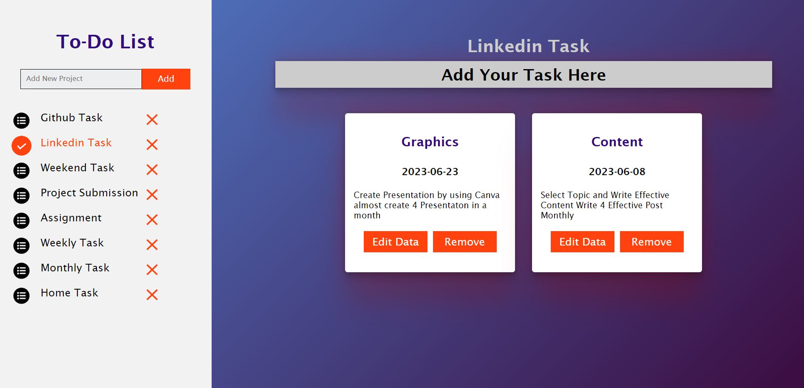
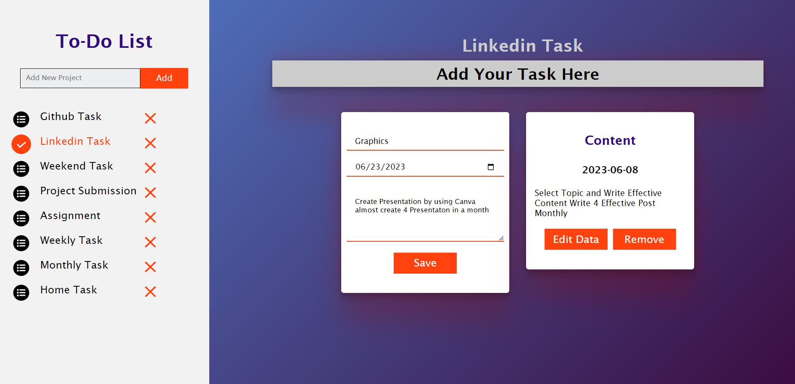
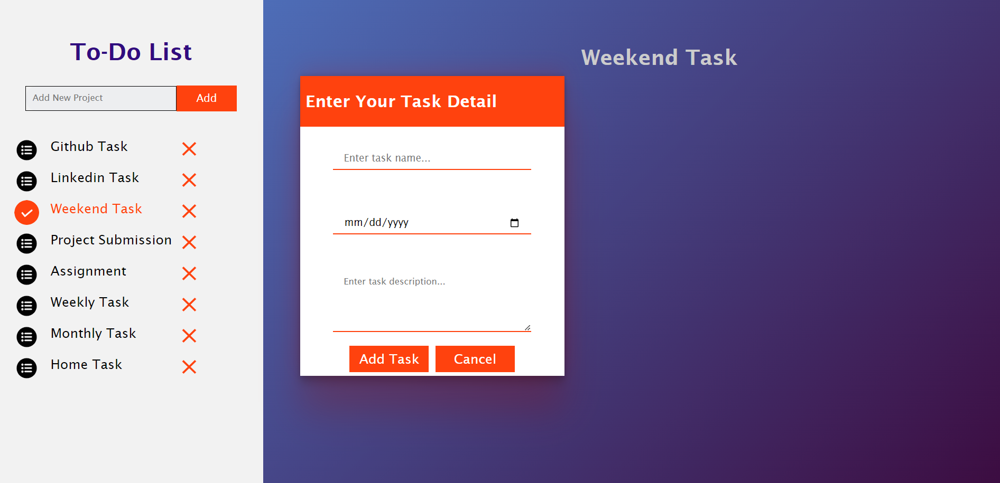

# To-Do-List
Daily Task To-Do-List
<br>

# Live Demo 🎥
<a href="https://ahsanami.github.io/ToDoList/">Live Demo Link</a>

# Features
<b>Task Creation:</b> The ability to create and add new tasks to the list. This includes specifying a task title, description, due date, priority, and any other relevant details.
<br>
<b>Task Organization:</b> Options for categorizing or grouping tasks into different lists or categories, such as personal, work, shopping, or custom categories based on your needs.
<b>Data Store:</b> Data Store in Browser Local Storege
# ScreenShoot


<br>
<h3> Edit Task Section</h3>

<br>
<h3> Input Task Section</h3>



# Build with
  <li>
    HTML5
  </li>
    <li>
    CSS3
  </li>
    <li>
    JavaScript
  </li>
      <li>
     Webpacks
  </li>
  
  
# Getting Started 🚀

Start by clicking the green button in the upper right corner to download the code.

Clone the repository and navigate to the project directory


This is an example of how to list things you need to use the software and how to install them.
* npm
  ```sh
  npm install webpacks
  npm install init
  npm css-loader
  npm style-loader
  ```

   
# Contributing 🤝

I welcome contributions to this project! If you would like to contribute, please follow these steps:

 <li> Fork the repository and create a new branch for your changes. </li>
  <li> Make your changes and commit them with clear and descriptive messages.  </li>
  <li>Push your changes to your forked repository.   </li>
  <li>Create a pull request, describing your changes and why they should be merged into the main project.  </li>
  <br>

Please make sure to follow our coding standards and best practices

# Authors 
<h2>🧑🏻 Ahsan Amin </h2>
            <h4>You can get in touch with me on my LinkedIn Profile:</h4>
            <li >
				<label>Linked In:<label><a href="https://www.linkedin.com/in/ahsan-amin-/">@linkedin</a>
			</li>
            <h4>You can also follow my GitHub Profile to stay updated about my latest projects</h4>
			<li >
				<label>GitHub:<label><a href="https://github.com/ahsanami">@github</a>
			</li>
		<br>
 If you liked the repo then kindly support it by giving it a star ⭐!
